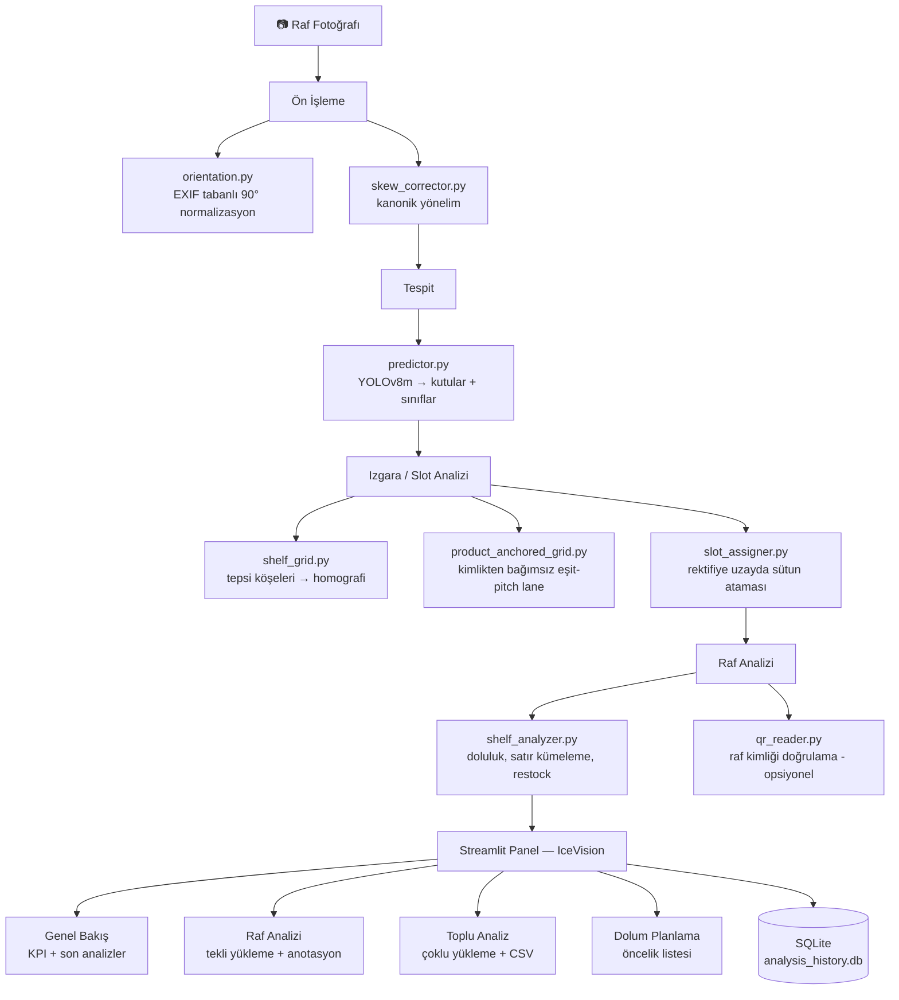

# 🍦 Ice Cream Shelf Detector (IceVision)

> Algida/Unilever tipi dondurma dolaplarının raf fotoğraflarını YOLOv8 ile analiz eden, ürün sayan ve dolum önerisi çıkaran bir bilgisayarlı görü hattı + Streamlit paneli.


---

## Bu proje ne yapar

1. Bir dolap/raf fotoğrafı yükleyin (veya toplu olarak birden fazla).
2. Eğitilmiş model (`models/best.pt`, bir **YOLO8m** checkpoint, 35 sınıf) fotoğraftaki ürünleri ve boş slotları tespit eder.
3. Tespitler, rafın gerçek fiziksel sütunlarına (slot/lane) homografi ile hizalanır — kamera açısı/perspektif fark etmeksizin her ürüne bir raf numarası + sütun numarası atanır.
4. Doluluk oranı, düşük güvenli tespitler (olası hasar/örtüşme) ve dolum önerileri hesaplanır.
5. Sonuçlar Streamlit panelinde (Türkçe arayüz, "IceVision") gösterilir ve SQLite'a kalıcı olarak kaydedilir.

Panel ayrıca isteğe bağlı olarak raf fotoğrafındaki QR etiketini okuyup raf kimliğini doğrulayabilir (`qr_reader.py`).

---

## Mimari



---

## Özellikler

- **35 sınıf tespiti** — Algida, Cornetto, Magnum, Nogger, Twister, Frigola, Viennetta, vb. gerçek ürün varyantları + `empty_slot`
- **Slot/lane tabanlı sayım** — tespitleri sınıftan bağımsız, rafın fiziksel eşit-pitch sütunlarına homografi ile oturtur; perspektif/eğiklikten etkilenmez
- **Yönelim normalizasyonu** — EXIF tabanlı 90° döndürme + kanonik yönelim düzeltmesi (içerik tahmini yok, güvenilirlik için)
- **Doluluk ve dolum uyarısı** — yapılandırılabilir eşik altındaki raflar/sütunlar işaretlenir
- **Anomali işaretleme** — düşük güvenli tespitler olası hasar/örtüşme olarak öne çıkar
- **QR doğrulama** — küçük/bulanık/eğik QR etiketleri için üç katmanlı decoder (zxing-cpp → WeChat → cv2), raf kimliğini fotoğraftan doğrular
- **Kalıcı geçmiş** — her analiz SQLite'a (`data/analysis_history.db`) yazılır; panel yeniden başlatılsa da Genel Bakış ve Son Analizler kaybolmaz
- **Toplu işleme** — birden fazla raf fotoğrafını tek seferde işleyip CSV dışa aktarma
- **Model karşılaştırma / diagnostik scriptleri** — nano/small/medium hız-doğruluk analizi, ızgara ve lane teşhis araçları

---

## Hızlı Başlangıç

```bash
# 1. Sanal ortamı kurun ve bağımlılıkları yükleyin
python3.10 -m venv venv
source venv/bin/activate
pip install -r requirements.txt

# 2. Paneli başlatın
streamlit run dashboard/app.py

# 3. http://localhost:8501 adresini açın ve bir raf fotoğrafı yükleyin
```

> **Not:** `requirements.txt` içindeki sürümler kasıtlı olarak sabitlenmiştir (`torch==2.3.0`, `numpy==1.26.4`, `ultralytics>=8.4.96`). Deploy edilen `models/best.pt` bir YOLOv8m (C2f blokları içeren) checkpoint'i olduğu için Ultralytics 8.2.x ile yüklenemez; Ultralytics'in daha yeni bir torch/numpy çekmesine izin vermeyin — Streamlit 1.35 ve scipy 1.13 `numpy<2` gerektirir. Ayrıntılar `requirements.txt` içindeki yorumlarda.

Eğitilmiş ağırlık (`models/best.pt`) yoksa panel demo modunda (sentetik tespitlerle) çalışmaya devam eder; hata fırlatmaz ama gerçek tespit yapmaz.

---

## Eğitim

```bash
# Veriyi hazırlayın (ham görseller data/raw/, YOLO formatlı etiketler data/annotations/)
python -m src.data.validator --images-dir data/raw --labels-dir data/annotations
python -m src.data.dataset_builder --raw-images data/raw/ --raw-labels data/annotations/

# Eğitim (varsayılan: yolov8m, config/config.yaml'daki hiperparametrelerle)
./scripts/train.sh yolov8m config/config.yaml

# Değerlendirme (verilmezse runs/ altındaki en son best.pt otomatik bulunur)
./scripts/evaluate.sh [weights_path] [split]
```

Doğrudan modül CLI'ları da kullanılabilir (hepsi `click` tabanlı):

```bash
python -m src.models.trainer --model yolov8m --config config/config.yaml [--resume]
python -m src.models.evaluator --weights models/best.pt --config config/config.yaml --split test --output-dir reports/
python -m src.models.predictor path/to/shelf.jpg --conf 0.5 --output-image out.jpg
```

Sentetik veri seti üzerinde hızlı deneme için:

```bash
python scripts/train_synthetic.py --variant yolov8m --epochs 100
python scripts/evaluate_model.py --weights runs/synthetic/yolov8m_*/weights/best.pt
python scripts/compare_models.py          # nano/small/medium karşılaştırması
python scripts/predict_demo.py --weights models/best.pt --image path/to/shelf.jpg
```

Ayrıntılı adımlar: [docs/TRAINING_GUIDE.md](docs/TRAINING_GUIDE.md)

### Izgara/Lane Teşhisi

Gerçek raf fotoğraflarında homografi ve lane atama kalitesini ölçmek için:

```bash
venv/bin/python scripts/diagnose_grid.py --images path/to/photos --out /tmp/grid_diag
venv/bin/python scripts/diagnose_lane.py --images path/to/photos --out /tmp/lane_diag
```

---

## Veri Seti Hazırlama

1. Dolap raf fotoğraflarını toplayın → `data/raw/`
2. [Roboflow](https://roboflow.com) ile etiketleyin, YOLO formatında dışa aktarın
3. `.txt` etiket dosyalarını `data/annotations/` altına koyun
4. `python -m src.data.validator` ile bütünlük kontrolü yapın
5. `python -m src.data.dataset_builder` ile train/val/test bölmelerini oluşturun (varsayılan 70/20/10)

Etiketleme rehberi: [docs/ANNOTATION_GUIDE.md](docs/ANNOTATION_GUIDE.md)
Mimari detayları: [docs/ARCHITECTURE.md](docs/ARCHITECTURE.md)

---

## Testler

```bash
pytest
pytest --cov=src --cov-report=term-missing
```

Test kapsamı: veri seti oluşturma, metrikler, yönelim normalizasyonu, eğik düzeltme, homografi tabanlı ızgara (`shelf_grid`), kimlikten bağımsız lane tespiti (`product_anchored_grid`), slot ataması, tarayıcı yönü/numaralandırma tutarlılığı, predictor ve shelf_analyzer.

---

## Proje Yapısı

```
icecream-shelf-detector/
├── config/
│   └── config.yaml         Merkezi yapılandırma: sınıflar, hiperparametreler, yollar, slot/dashboard ayarları
├── data/                    raw / augmented / annotations / splits / synthetic_dataset / thumbnails / analysis_history.db
├── src/
│   ├── data/                scraper, augmentor, dataset_builder, validator
│   ├── models/               trainer, evaluator, predictor, model_comparison
│   ├── analysis/              shelf_analyzer, shelf_grid, product_anchored_grid, slot_assigner,
│   │                          orientation, skew_corrector, metrics, report_generator
│   └── utils/                 logger, visualization
├── dashboard/                Streamlit panel ("IceVision", Türkçe arayüz)
│   ├── app.py                 Genel Bakış (giriş sayfası) + SQLite tabanlı KPI'lar
│   ├── db.py                  SQLite kalıcı analiz geçmişi
│   ├── theme.py                Tema/stil yardımcıları
│   ├── components/             sidebar, charts, widgets, analyses_list
│   └── pages/
│       ├── 01_shelf_analysis.py    Tekli raf analizi
│       ├── 02_batch_analysis.py    Toplu analiz + CSV
│       └── _03_restock_planner.py  Dolum planlama (dosya adı "_" ile başladığı için
│                                    Streamlit gezinme menüsünde şu an gizli/pasif)
├── qr_reader.py             Katmanlı QR decoder (zxing-cpp → WeChat → cv2) — raf kimliği doğrulama
├── notebooks/               EDA, eğitim denemeleri, hata analizi
├── tests/                   pytest test paketi (11 dosya)
├── scripts/
│   ├── demo.sh / train.sh / evaluate.sh   Kabuk sarmalayıcıları
│   ├── train_synthetic.py / evaluate_model.py / compare_models.py / predict_demo.py
│   └── diagnose_grid.py / diagnose_lane.py   Izgara/lane teşhis araçları
├── docker/
│   └── Dockerfile           Çok aşamalı build, Streamlit'i 8501 portunda servis eder
├── docs/                    ARCHITECTURE.md, TRAINING_GUIDE.md, ANNOTATION_GUIDE.md
├── models/                  best.pt (deploy edilen ağırlık) + eski checkpoint'ler
├── requirements.txt         Sabitlenmiş sürümler (bkz. yukarıdaki "Hızlı Başlangıç" notu)
└── setup.py                 CLI giriş noktaları: shelf-train, shelf-eval, shelf-predict, shelf-validate
```

---

## Tech Stack

| Katman | Teknoloji |
|-------|-----------|
| Tespit | YOLO8m (Ultralytics ≥8.4.96) |
| Derin öğrenme | PyTorch 2.3.0 |
| Bilgisayarlı görü | OpenCV-contrib 4.9 |
| Artırma (augmentation) | Albumentations 1.4.6 |
| Panel | Streamlit 1.35.0 |
| Grafikler | Plotly 5.22, Matplotlib, Seaborn |
| QR okuma | zxing-cpp (birincil), OpenCV WeChat + `cv2.QRCodeDetector` (yedek) |
| Kalıcı depolama | SQLite (`dashboard/db.py`) |
| Veri | Pandas, NumPy (<2), scikit-learn |
| Raporlama | Jinja2 HTML + isteğe bağlı WeasyPrint (HTML→PDF) |
| Test | pytest, pytest-cov |
| Konteynerleştirme | Docker (çok aşamalı) |

---

## Docker

```bash
docker build -t icecream-shelf-detector -f docker/Dockerfile .
docker run -p 8501:8501 icecream-shelf-detector
```

---

## CLI Giriş Noktaları

`pip install -e .` sonrası kullanılabilir hale gelen komutlar (`setup.py`):

```bash
shelf-train      # src.models.trainer:main
shelf-eval       # src.models.evaluator:main
shelf-predict    # src.models.predictor:main
shelf-validate   # src.data.validator:main
```

---

## Lisans

Proje kök dizininde henüz bir `LICENSE` dosyası bulunmuyor — dağıtım/paylaşım öncesi eklenmesi gerekir.

---

## Yazar

Staj Projesi — 2026
YOLO8m, Streamlit ve Türkçe bir dolum planlama arayüzü ile geliştirildi.
